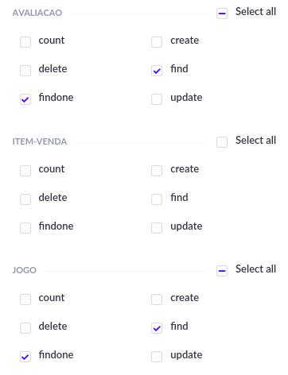
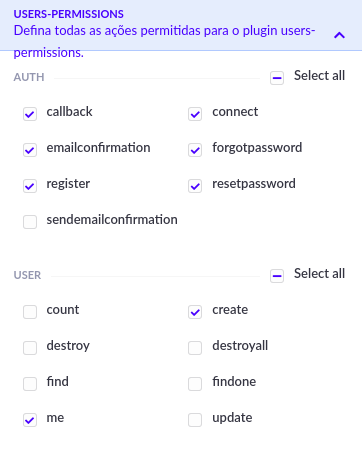
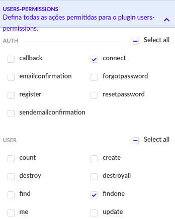
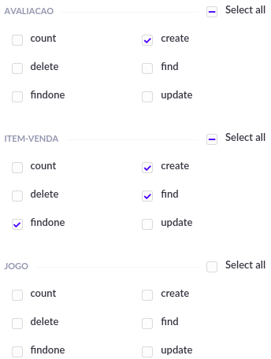
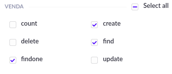

# Configuração api

## Requisitos
- Postgresql
- Nodejs >= 12.x

## Configuração de níveis e permissões

Configurar os níveis e permissões (public e authenticated) da seguinte forma

1. Public 

2. Authenticated

